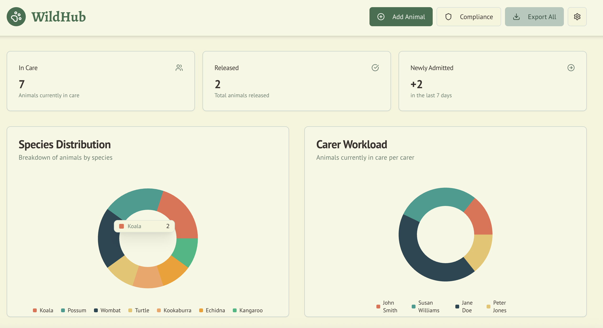
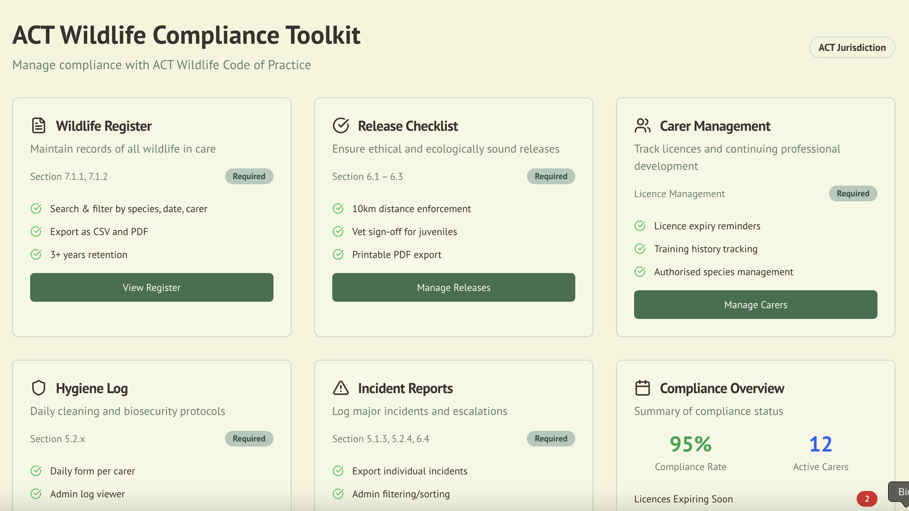
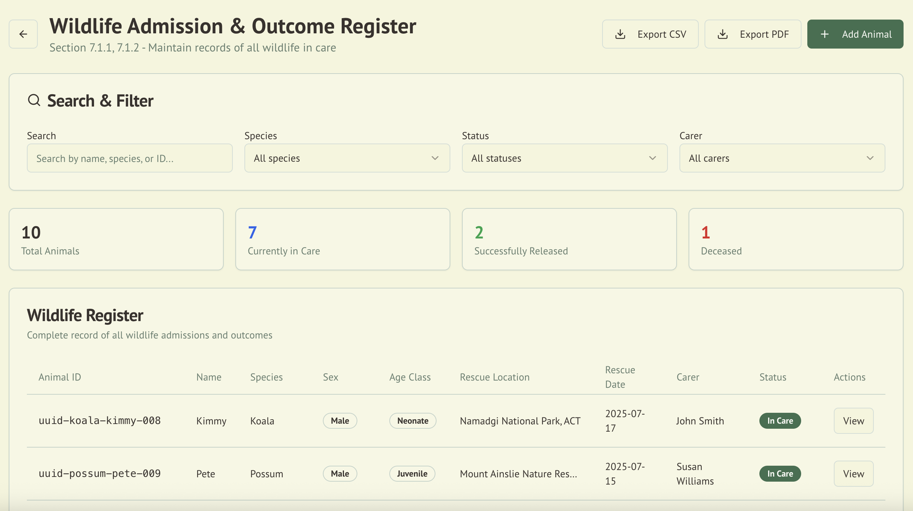
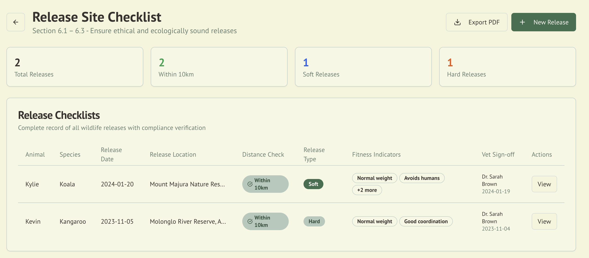
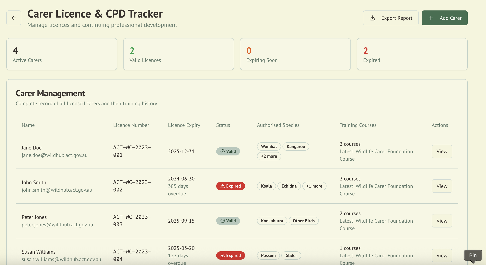
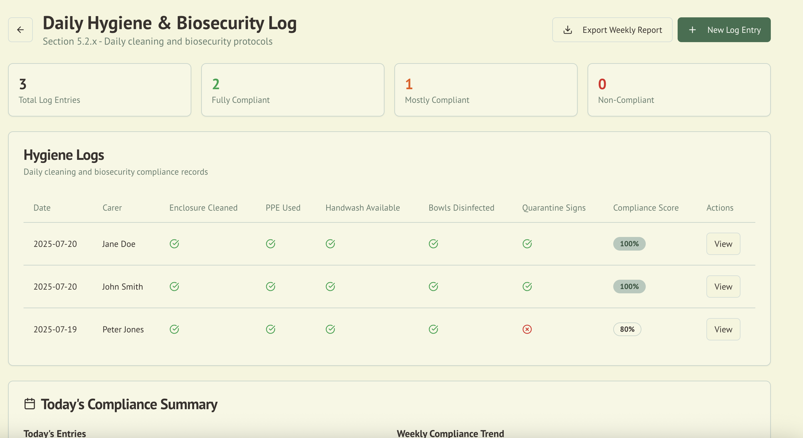
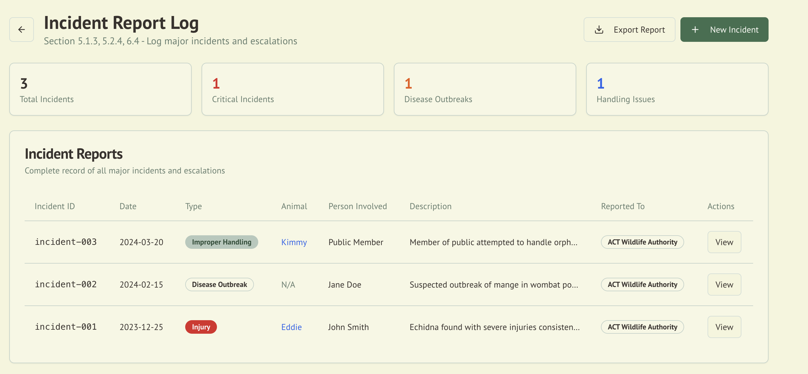
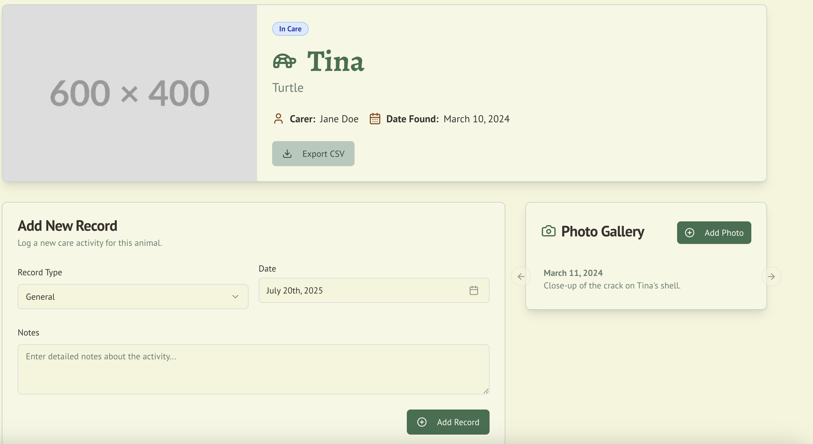
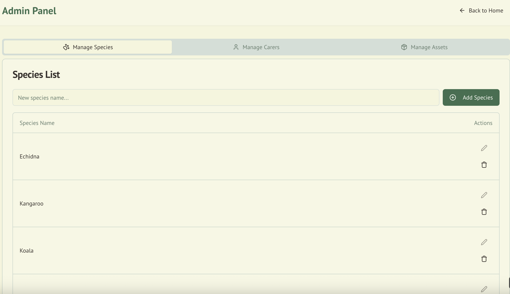
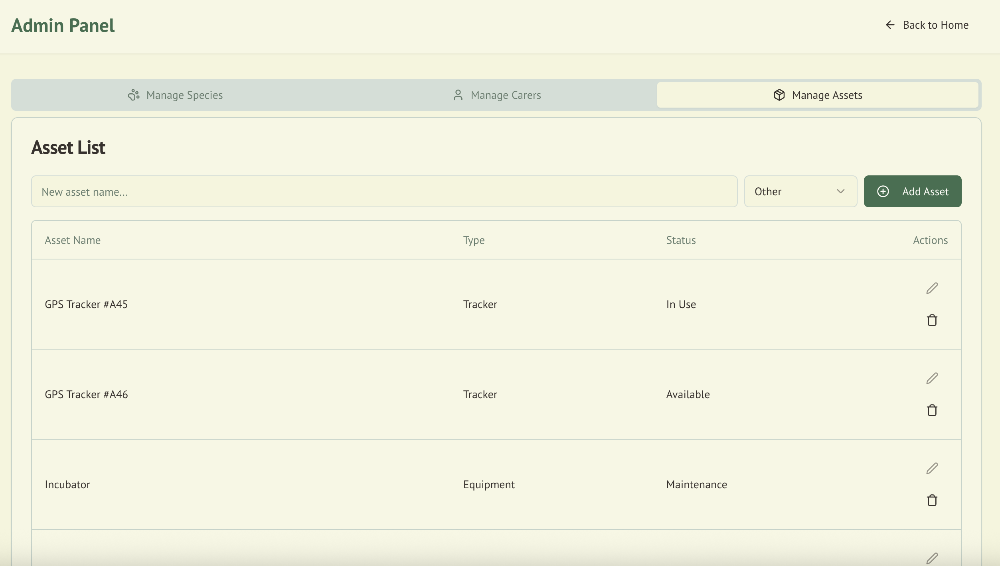

# WildTrack360 - Wildlife Conservation Management System

WildTrack360 is a comprehensive wildlife conservation management application designed to help wildlife carers track animals throughout their entire lifecycle, from initial admission to release or unfortunate outcomes. The system also manages critical assets like GPS trackers and equipment to ensure efficient wildlife care operations, with full compliance tracking for ACT Wildlife Code of Practice requirements.

## 🖼️ Screenshots

### Main Dashboard
The dashboard provides a comprehensive overview of your wildlife conservation operations with real-time statistics and visual data:



**Features shown:**
- **Summary Cards**: Quick stats showing 7 animals in care, 2 total releases, and +2 recent admissions
- **Species Distribution Chart**: Visual breakdown of animals by species (Koala, Possum, Wombat, Turtle, Kookaburra, Echidna, Kangaroo)
- **Carer Workload Chart**: Distribution of animals among carers (John Smith, Susan Williams, Jane Doe, Peter Jones)
- **Action Buttons**: Add Animal, Export All, and Settings options

### ACT Wildlife Compliance Toolkit
The compliance dashboard provides comprehensive tools for managing ACT Wildlife Code of Practice requirements:



**Features shown:**
- **Compliance Modules**: Wildlife Register, Release Checklist, Carer Management, Hygiene Logs, Incident Reports
- **Compliance Status**: Real-time compliance scoring and status indicators
- **ACT Requirements**: Section-specific compliance tracking (7.1.1, 6.1-6.3, 5.2.x, etc.)
- **Quick Actions**: Export functionality and detailed view access

### Wildlife Admission & Outcome Register
Complete record keeping for all wildlife admissions with ACT compliance requirements:



**Features shown:**
- **Comprehensive Records**: Animal ID, species, sex, age class, rescue details
- **Search & Filter**: Advanced filtering by species, status, carer, and date ranges
- **Export Capability**: CSV and PDF export for compliance reporting
- **3+ Year Retention**: Automatic record retention for regulatory compliance

### Release Site Checklist
Ensure ethical and ecologically sound releases with compliance verification:



**Features shown:**
- **Distance Enforcement**: 10km distance checking with GPS coordinates
- **Fitness Assessment**: Pre-release health and behavior indicators
- **Veterinary Sign-off**: Required vet approval for juveniles and long-term care
- **Release Types**: Soft, Hard, and Passive release tracking
- **Compliance Scoring**: Real-time compliance status and ACT requirements

### Carer Licence & CPD Tracker
Manage carer licences, training, and continuing professional development:



**Features shown:**
- **Licence Management**: Expiry tracking with 30-day reminders
- **Training History**: Course completion and certification tracking
- **Authorised Species**: Species-specific authorization management
- **Compliance Alerts**: Automatic notifications for expiring licences
- **Performance Tracking**: Carer workload and outcome monitoring

### Daily Hygiene & Biosecurity Log
Track daily cleaning protocols and biosecurity compliance:



**Features shown:**
- **Daily Protocols**: Enclosure cleaning, PPE usage, handwashing verification
- **Compliance Scoring**: Real-time compliance percentage calculation
- **Biosecurity Tracking**: Quarantine procedures and disease prevention
- **Photo Documentation**: Visual evidence of cleaning procedures
- **Weekly Reports**: Automated compliance reporting

### Incident Report Log
Comprehensive incident tracking and reporting for regulatory compliance:



**Features shown:**
- **Incident Classification**: Escape, Injury, Disease Outbreak, Improper Handling
- **Critical Incident Alerts**: Immediate notification for serious incidents
- **Authority Reporting**: Automatic escalation to relevant authorities
- **Timeline Tracking**: Incident occurrence, action taken, and follow-up
- **Documentation**: Complete audit trail with attachments

### Recent Admissions & Animal Records
Track admissions over time and browse individual animal profiles:


**Features shown:**
- **Admissions Chart**: 30-day bar chart showing admissions on July 10th, 15th, and 16th
- **Animal Cards**: Grid view of animals (Kimmy, Pete, Willy, Tina) with photo placeholders
- **Search Functionality**: Search bar for finding specific animals
- **View Options**: Toggle between grid and list views

### Individual Animal Management
Detailed view for managing individual animals and their care records:



**Features shown:**
- **Animal Profile**: Complete details for "Pete" (Possum) including status, carer assignment, and admission date
- **Care Records**: Add new activity logs with record types, dates, and detailed notes
- **Photo Gallery**: Upload and manage photos documenting the animal's journey
- **Data Export**: Download comprehensive animal records to CSV

### Administrative Panel - Species Management
Manage the species database and track conservation efforts:



**Features shown:**
- **Species List**: Current species (Echidna, Kangaroo, Koala) with edit/delete actions
- **Add Species**: Input field and button for adding new species
- **Navigation Tabs**: Switch between Species, Carers, and Assets management

### Administrative Panel - Asset Management
Track GPS trackers and equipment inventory:



**Features shown:**
- **Asset List**: GPS Trackers (#A45, #A46) and Incubator with status tracking
- **Asset Types**: Tracker and Equipment categories
- **Status Monitoring**: Available, In Use, and Maintenance statuses
- **Add Assets**: Input field with type dropdown for adding new assets

## 🌿 Features

### 📊 Dashboard Overview
- **Real-time Statistics**: Track animals currently in care, total releases, and recent admissions
- **Species Distribution**: Visual breakdown of animals by species with interactive charts
- **Carer Workload Management**: Monitor animal distribution across carers to ensure balanced workloads
- **Recent Admissions Tracking**: View admission trends over the last 30 days with interactive filtering

### 🛡️ ACT Wildlife Compliance Toolkit
- **Wildlife Admission & Outcome Register**: Complete record keeping with 3+ year retention (Section 7.1.1, 7.1.2)
- **Release Site Checklist**: Distance enforcement, fitness assessment, and vet sign-off (Section 6.1-6.3)
- **Carer Licence & CPD Tracker**: Licence expiry tracking and training management
- **Daily Hygiene & Biosecurity Log**: Daily cleaning protocols and compliance scoring (Section 5.2.x)
- **Incident Report Log**: Comprehensive incident tracking and authority reporting (Section 5.1.3, 5.2.4, 6.4)
- **Compliance Dashboard**: Real-time compliance scoring and status monitoring
- **Export Functionality**: PDF and CSV export for regulatory reporting
- **Jurisdiction Awareness**: ACT-specific requirements and policy enforcement

### 🐨 Animal Lifecycle Management
- **Complete Animal Profiles**: Detailed records including species, carer assignment, and admission date
- **Care Activity Logging**: Add detailed records for each care activity with timestamps and notes
- **Photo Gallery**: Upload and manage photos for each animal's journey
- **Status Tracking**: Monitor animals from "In Care" to "Released" or "Deceased"
- **Data Export**: Export individual animal records to CSV format

### 👥 Carer Management
- **Carer Assignment**: Assign animals to specific carers with workload balancing
- **Performance Tracking**: Monitor carer performance and animal outcomes
- **Workload Distribution**: Visual charts showing animal distribution across carers
- **Licence Management**: Track licence expiry dates and training requirements
- **Authorised Species**: Manage species-specific authorizations for each carer

### 🏷️ Species Management
- **Species Database**: Maintain a comprehensive list of wildlife species
- **Add/Edit/Delete**: Full CRUD operations for species management
- **Species-specific Tracking**: Track animals by species for conservation insights

### 📱 Asset Management
- **GPS Tracker Management**: Track GPS devices assigned to animals
- **Equipment Inventory**: Manage incubators, medical equipment, and other assets
- **Status Monitoring**: Track asset availability (Available, In Use, Maintenance)
- **Asset Assignment**: Link assets to specific animals or carers

### 🔍 Search and Filtering
- **Animal Search**: Find specific animals by name or characteristics
- **Grid/List Views**: Toggle between different viewing modes
- **Date-based Filtering**: Filter records by admission dates and time periods
- **Compliance Filtering**: Filter by compliance status and requirements

### 📋 Compliance Features
- **Real-time Compliance Scoring**: Automatic calculation of compliance percentages
- **ACT Code Reference**: Direct links to relevant sections of ACT Wildlife Code
- **Alert System**: Notifications for non-compliance and expiring items
- **Audit Trail**: Complete documentation for regulatory inspections
- **Multi-tenant Support**: Jurisdiction-aware feature toggling
- **Jurisdiction Configuration**: Dynamic compliance requirements based on jurisdiction

### 🌍 Multi-Jurisdiction Support
WildTrack360 supports multiple jurisdictions with different compliance requirements:

**ACT (Australian Capital Territory)**
- **Enabled Forms**: Release Checklist, Incident Log, Hygiene Log, Carer Licence
- **Templates**: ACT Register, ACT Release Checklist
- **Release Distance**: Enforced (10km rule)
- **Vet Sign-off**: Required for juveniles and long-term care
- **Record Retention**: 3+ years

**NSW (New South Wales)**
- **Enabled Forms**: Release Checklist, Incident Log
- **Templates**: NSW Register
- **Release Distance**: Not enforced
- **Vet Sign-off**: Not required
- **Record Retention**: 2+ years

**Jurisdiction Configuration System**
- **Dynamic Feature Toggling**: Forms and requirements automatically adjust based on jurisdiction
- **Template Management**: Jurisdiction-specific templates and forms
- **Compliance Enforcement**: Automatic enforcement of jurisdiction-specific rules
- **Scalable Architecture**: Easy addition of new jurisdictions and requirements

## 🚀 Getting Started

### Prerequisites
- Node.js 18+ 
- npm or yarn
- Modern web browser
- Google AI API key (for AI features)
- Firebase project setup (for database)

### Installation

1. **Clone the repository**
   ```bash
   git clone https://github.com/your-username/wildtrack360.git
   cd wildtrack360
   ```

2. **Install dependencies**
   ```bash
   npm install
   ```

3. **Set up environment variables**
   ```bash
   cp .env.example .env.local
   ```
   Edit `.env.local` with your configuration values.

4. **Run the development server**
   ```bash
   npm run dev
   ```
   This starts the development server with Turbopack on port 9002.

5. **Open your browser**
   Navigate to [http://localhost:9002](http://localhost:9002)

### Building for Production

```bash
npm run build
npm start
```

### Available Scripts

- `npm run dev` - Start development server with Turbopack on port 9002
- `npm run build` - Build the application for production
- `npm run start` - Start the production server
- `npm run lint` - Run ESLint
- `npm run typecheck` - Run TypeScript type checking
- `npm run genkit:dev` - Start Genkit AI development server
- `npm run genkit:watch` - Start Genkit AI with watch mode

## 🏗️ Project Structure

```
WildTrack360/
├── src/
│   ├── app/                    # Next.js app directory
│   │   ├── admin/             # Admin panel pages
│   │   ├── animals/           # Animal management pages
│   │   ├── compliance/        # ACT Compliance Toolkit pages
│   │   │   ├── carers/        # Carer management and licensing
│   │   │   ├── hygiene/       # Daily hygiene and biosecurity logs
│   │   │   ├── incidents/     # Incident reporting and tracking
│   │   │   ├── register/      # Wildlife admission register
│   │   │   └── release-checklist/ # Release site compliance
│   │   └── layout.tsx         # Root layout
│   ├── components/            # Reusable UI components
│   │   ├── ui/               # Base UI components
│   │   └── *.tsx             # Feature-specific components
│   ├── lib/                  # Utility functions and data
│   └── hooks/                # Custom React hooks
├── public/                   # Static assets
└── docs/                     # Documentation
```

## 🛠️ Technology Stack

- **Framework**: Next.js 15.3.3 with App Router and Turbopack
- **Styling**: Tailwind CSS 3.4.1 with animations
- **UI Components**: Radix UI primitives with custom shadcn/ui components
- **Charts**: Recharts 2.15.1 for data visualization
- **Icons**: Lucide React 0.475.0
- **TypeScript**: Full type safety with React 18.3.1
- **Forms**: React Hook Form 7.54.2 with Zod validation
- **Tables**: TanStack React Table 8.19.3
- **AI Integration**: Genkit 1.14.1 with Google AI
- **Database**: Firebase 11.9.1
- **Date Handling**: date-fns 3.6.0
- **Carousel**: Embla Carousel React 8.6.0
- **Configuration Management**: Environment-based jurisdiction configuration for multi-organization deployment

## 🌍 Multi-Jurisdiction Deployment

WildTrack360 supports deployment for multiple organizations across different Australian jurisdictions. Each organization can have its own configuration through environment variables.

### Environment Configuration

1. **Copy the example environment file:**
   ```bash
   cp env.example .env.local
   ```

2. **Configure your jurisdiction and organization:**
   ```bash
   # Jurisdiction (ACT, NSW, VIC, QLD, WA, SA, TAS, NT)
   NEXT_PUBLIC_JURISDICTION=ACT
   
   # Organization details
   NEXT_PUBLIC_ORGANIZATION_NAME=ACT Wildlife
   NEXT_PUBLIC_ORGANIZATION_CONTACT=contact@actwildlife.org.au
   NEXT_PUBLIC_ORGANIZATION_LOGO=/act-logo.png
   ```

### Supported Jurisdictions

Each jurisdiction has different compliance requirements:

- **ACT**: Full compliance toolkit (all forms enabled)
- **NSW**: Basic compliance (release checklist, incident log)
- **VIC**: Standard compliance (release checklist, incident log, hygiene log)
- **QLD**: Enhanced compliance (release checklist, incident log, carer licence)
- **WA**: Full compliance toolkit
- **SA**: Standard compliance with distance enforcement
- **TAS**: Basic compliance
- **NT**: Enhanced compliance with distance enforcement

### Deployment per Organization

To deploy for a new organization:

1. Set up a new deployment environment
2. Configure the environment variables for that organization
3. Deploy the same codebase with different environment settings

This allows you to maintain a single codebase while serving multiple organizations with their specific jurisdiction requirements.

## 📋 Key Components

- **Dashboard Stats**: Real-time statistics and metrics using Recharts
- **Animal Cards**: Individual animal profile displays with responsive design
- **Charts**: Species distribution and carer workload visualizations with Recharts
- **Forms**: Add animal, record, and asset management forms with React Hook Form and Zod validation
- **Tables**: Data display for animals, species, and assets using TanStack React Table
- **Dialogs**: Modal interfaces for adding/editing records with Radix UI
- **AI Integration**: Genkit-powered features for enhanced functionality
- **Carousel**: Image galleries and content sliders with Embla Carousel
- **Compliance Components**: Compliance scoring, status badges, and requirement tracking
- **Navigation**: Consistent home and back navigation throughout the application

## 📄 License

This project is licensed under the MIT License - see the [LICENSE](LICENSE) file for details.