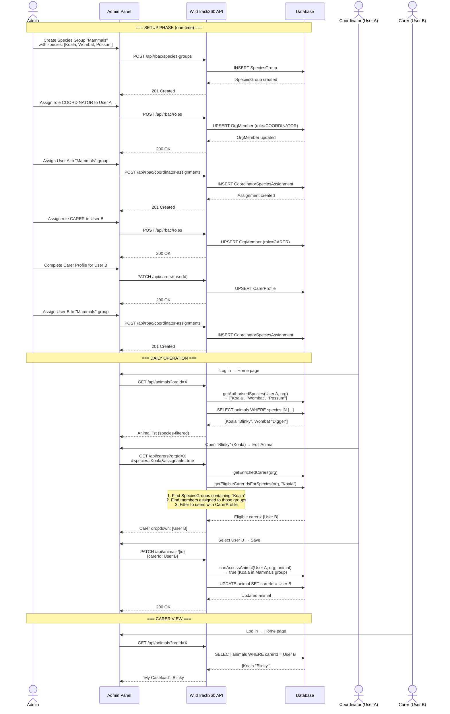

# WildTrack360 — Admin Guide: Roles, Species Groups & Carer Assignment

## Overview

WildTrack360 uses two complementary access control systems to manage who can see and manage which animals:

| System | What it controls | Who it applies to |
|--------|-----------------|-------------------|
| **RBAC** (Role-Based Access Control) | *What actions* a user can perform (create animals, manage users, export reports, etc.) | All users |
| **SBAC** (Species-Based Access Control) | *Which animals* a user can see and manage, based on species | Coordinators and Carers |

Together they answer two questions: **"Can this user do this action?"** (RBAC) and **"Can this user see this animal?"** (SBAC).

---

## 1. Roles (RBAC)

Every organisation member has exactly one role. Roles form a hierarchy:

```
ADMIN  (highest)
  └── COORDINATOR
        └── CARER  (lowest — default)
```

### Permission Matrix

| Permission | ADMIN | COORDINATOR | CARER |
|-----------|:-----:|:-----------:|:-----:|
| View all animals in org | Yes | — | — |
| View animals in assigned species groups | Yes | Yes | — |
| View own assigned animals | Yes | Yes | Yes |
| Create animals | Yes | Yes | — |
| Assign carers to animals | Yes | Yes | — |
| Edit any accessible animal | Yes | Yes | — |
| Edit own assigned animals | Yes | Yes | Yes |
| Delete animals | Yes | — | — |
| Manage users & roles | Yes | — | — |
| Manage species groups | Yes | — | — |
| Assign coordinators to species groups | Yes | — | — |
| View org-wide reports | Yes | — | — |
| View species-scoped reports | Yes | Yes | — |
| Export reports | Yes | Yes | — |
| Manage settings | Yes | — | — |
| View carer workload dashboard | Yes | Yes | — |

### How roles are assigned

1. Navigate to **Admin → People** tab
2. Find the user in the unified members table
3. Select their role from the dropdown (ADMIN, COORDINATOR, or CARER)
4. The system prevents demoting the last ADMIN in the organisation

> **Note:** New members default to the CARER role. The first admin is self-provisioned: when a Clerk `org:admin` user logs in and has no WildTrack360 role yet, they are automatically provisioned as ADMIN.

---

## 2. Species Groups (SBAC)

Species Groups are the building blocks of species-based access. A species group is a named collection of species — for example:

| Group Name | Species Included |
|-----------|-----------------|
| Macropods | Kangaroo, Wallaby, Pademelon |
| Koalas | Koala |
| Birds of Prey | Wedge-tailed Eagle, Barn Owl, Kookaburra |
| Mammals | Koala, Wombat, Possum, Kangaroo |

### Creating species groups

1. Navigate to **Admin → Species Groups** tab (ADMIN only)
2. Click **Create Species Group**
3. Enter a name (a URL-friendly slug is auto-generated)
4. Select the species that belong to this group using the badge picker, or type in unlisted species
5. Save

### How SBAC works for each role

| Role | What they can see |
|------|------------------|
| **ADMIN** | All animals in the organisation (no species filtering) |
| **COORDINATOR** | Only animals whose species appears in one of their assigned species groups |
| **CARER** | Only animals explicitly assigned to them (via the `carerId` field on the animal) |

**Important rules:**

- A **Coordinator with no species group assignments sees no animals**. They must be assigned to at least one species group.
- A **Carer with no species group assignments is not eligible** to receive animals. They must be assigned to at least one species group to appear in the carer dropdown.
- Species matching is **case-preserving** — the species names in the group must match how they appear on the animal records (e.g., "Koala" not "koala").

---

## 3. Assigning Coordinators & Carers to Species Groups

### From the People tab
1. Go to **Admin → People**
2. Find the COORDINATOR or CARER user in the unified table
3. Click the species group badges in the **Species Groups** column to toggle assignments on/off
4. Assigned groups show as solid badges; unassigned groups show as dashed outlines

### From the Species Groups tab
1. Go to **Admin → Species Groups**
2. Edit a species group
3. Use the **Assign Coordinator** dropdown to add members
4. Click the **×** on a badge to remove an assignment

> Both methods create the same underlying `CoordinatorSpeciesAssignment` record linking the user to the species group.

---

## 4. Carer Profiles

Before a carer can be assigned animals, they need a **complete carer profile**. A profile is considered complete when the CarerProfile record exists in the system.

### Setting up a carer profile
1. Navigate to **Admin → People** tab
2. Find the carer in the unified members table — their **Profile** column shows "Incomplete" if no profile exists
3. Click the **pen icon** in the Actions column to open the edit dialog
4. Fill in their details:
   - Phone, license number
   - Address fields (street, suburb, state, postcode)
   - Specialties, notes
   - Active toggle
5. Save — their profile status changes to "Complete"

### Why this matters
When assigning a carer to an animal, the dropdown only shows carers who:
1. Have a **complete profile** (`hasProfile = true`), AND
2. Are **assigned to a species group** that includes the animal's species

If a carer doesn't appear in the dropdown, check both conditions.

---

## 5. Assigning a Carer to an Animal

When a Coordinator or Admin opens an animal's detail page and clicks **Edit Animal**:

1. The system fetches eligible carers by calling `/api/carers` with:
   - `species` = the animal's species (e.g., "Koala")
   - `assignable` = true (must have a complete profile)
2. The API filters carers to those who:
   - Have a CarerProfile record (complete profile)
   - Are assigned to a species group containing that species
3. Only eligible carers appear in the dropdown
4. Selecting a carer and saving sends a `PATCH` to update the animal's `carerId`

---

## 6. End-to-End Setup Sequence

Here's the recommended order for setting up a new organisation:

```
Step 1: Go to Admin → People, invite users via email
         ↓
Step 2: First admin self-provisions (automatic on login)
         ↓
Step 3: Create Species Groups (Admin → Species Groups tab)
         ↓
Step 4: Back in People tab, assign roles (COORDINATOR or CARER)
         ↓
Step 5: Still in People tab, toggle species group badges for each user
         ↓
Step 6: Click pen icon to complete Carer Profiles
         ↓
Step 7: Coordinators can now see animals in their species
        and assign eligible carers to those animals
```

---

## 7. Sequence Diagram — Assigning a Carer to an Animal



---

## 8. Troubleshooting

| Problem | Likely Cause | Fix |
|---------|-------------|-----|
| Coordinator sees no animals | No species group assignments | Assign them to at least one species group via the People tab |
| Carer doesn't appear in dropdown | Missing carer profile OR no species group assignment | Complete their profile (pen icon in People tab) AND assign them to a species group containing the animal's species |
| Carer sees no animals on home page | No animals assigned to them via `carerId` | A coordinator/admin needs to assign animals to them |
| Coordinator can't see a specific animal | Animal's species is not in any of their assigned groups | Add the species to one of their groups, or assign them to a group that includes it |
| "Cannot demote the last admin" error | Trying to change the only ADMIN to a lower role | Promote another user to ADMIN first |
| Species group has correct species but filtering doesn't work | Case mismatch between species group and animal records | Ensure the species name in the group matches the animal's species exactly (e.g., "Koala" not "koala") |
